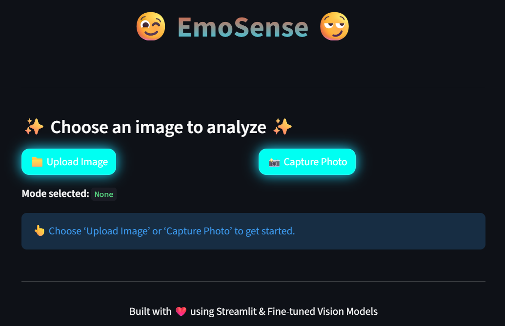

# EmotionTeller
**The Erdős Institute Deep Learning Bootcamp Summer 2025**

**Team Members:**
- [AIQI CHENG](https://www.linkedin.com/in/aiqi-adia-cheng/)
- [JULIO CACERES](https://www.linkedin.com/in/julio-caceres-761979184/)
- [CISIL KARAGUZEL](https://www.linkedin.com/in/cisil-karaguzel/)
- [MANIMUGDHA SAIKIA](https://www.linkedin.com/in/manimugdha-saikia-phd-54b455178/)

## Overview

Facial expression recognition is a crucial component for improving human-AI interaction and represents a core problem in computer vision, with applications in areas such as image captioning and behavioral analysis. The goal of this project is to develop a model which is capable of detecting faces and classifying emotional expressions accurately, particularly in group image settings. To achieve this, the project employs two complementary deep learning approaches: a fine-tuned YOLO model for a single step face and emotion detection, and a two-stage framework that integrates an automatic face detector with a fine-tuned emotion classifier for refined prediction.

## Dataset

- 221 images of people in natural, unconstrained environments are taken from “Human Group Emotions Labelled” (1) and “Emotic” (2) datasets combined.  We customized labels and facial positions to these 221 images. We separated 43 images from this set for final testing for both of the models. (Train Set: 178 Photos, ~1100 labelled people with emotion labels and bbox information; Final Test Set: 43 Photos, ~260 labelled people with emotion labels and bbox information)
- For the two-stage model, in addition, we added single face photos from “FACES database” (3) and a subset of “RAF database” (4). (Single face photos: ~72 images from FACES database, ~1900 images from RAF database)


## Data Resources: 
- Human Group Emotions Labelled: A dataset of 162 images with multiple labeled bounding boxes and one of seven discrete emotion labels per face. Focuses on group-level emotion localization in cluttered scenes: [link](https://huggingface.co/datasets/juanbtbx/Human-Group-Emotions-Labelled)

- Emotic: 23,571 images of people in natural, unconstrained environments. Annotated with 26 categorical emotions and continuous Valence–Arousal–Dominance (VAD) scores, capturing contextual cues like body language and scene type

- FACES database: 72 images of naturalistic faces of young, middle, old women and men displaying each of six facial expressions: neutrality, sadness, disgust, fear, anger, and happiness. [link](https://faces.mpdl.mpg.de/imeji/collection/IXTdg721TwZwyZ8e?q=)

- The Real-world Affective Faces Database (RAF-DB): [link](https://www.kaggle.com/datasets/shuvoalok/raf-db-dataset/)

## Models

- YOLOv11m: This is a state-of-the-art model for object detection. Initially trained on the COCO dataset to detect over 80 different kinds of objects. We finetuned this model using dataset (1) and (2).
- YOLOv11m-face: Similar to the previous model but trained specifically to detect faces in crowds. Once again, we finetuned this model using dataset (1) and (2).
- Two-Stage: This model begins with an object detection model to identify the faces in every picture which is trained using dataset (1) and (2). Then, to every cropped picture, a classification model trained on dataset (3) and (4) is applied. We have two versions of this model, the first one uses OpenCV DNN SSD for object detection whereas the second one uses Yolo11n-face. Both versions use Resnet18 for classification.

## App
We build an app using streamlit where you can either upload or capture an image and choose one of our models. It outputs an annotated picture along with a dataframe with information about the bounding boxes and labels. Here is a demonstration of our app running on a fun moment of our team.

<center> 

</center>

## Repository Structure:
```
EmotionTeller/
├── app/
│   └── inputs/           # latest inputs and outputs of the app
|       ├── annotated_output_image.ext # latest annotated image
|       ├── face_data.csv   # latest output dataframe
|       ├── input_image.ext # latest input image to the model
│   └── two_step_model/     # model files for two-stage pipeline
|       └── BaselineModels
|             ├── 
```
